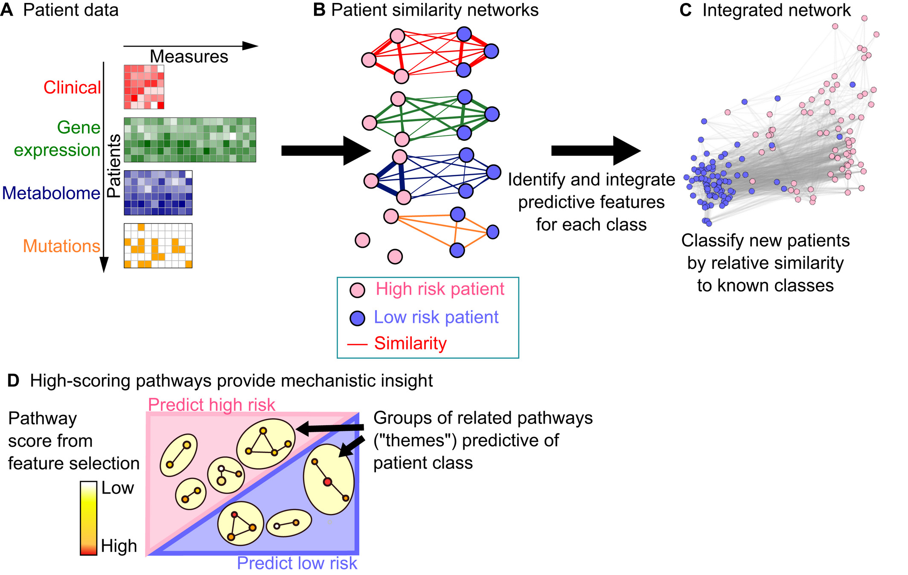

Our lab's research goal is to improve data-driven clinical decision-making through an improved understanding of how the genome impacts phenotype at various levels of system organization. 

## Multi-modal data integration and machine learning for precision oncology
We are developing novel computational methods to predict patient outcome by integrating multi-modal data, including clinical, genomic and imaging profiles. Machine learning models using genomic data [need to be interpretable](https://www.sciencedirect.com/science/article/pii/S0022283618305321?via%3Dihub) to minimize bias from small sample sizes and to drive rational drug design by providing mechanistic insight. We [develop interpretable machine learning approaches](https://www.embopress.org/doi/full/10.15252/msb.20188497) that build in prior biological knowledge about tissue- and disease-specific genome regulation, and so provide mechanistic insight for effective hypothesis generation. Current projects include extending the model to genomic data types in routine use for tumour profiling, such as DNA methylation for brain tumours, and gaining improved discriminability using newer methods such as  deep learning.

Pai et al. (2019). <i>Mol Sys Biol</i> 15:e8497 illustrating the use of patient similarity networks to integrate multi-modal patient data.  

## Workflows for high-throughput biomarker discovery from cohort-scale data
We are developing a software workflow that combines exploratory data analysis and machine learning for high-throughput biomarker discovery. These will be applied to selected datasets with availability of clinical outcomes and genomic data, such as those from The Cancer Genome Atlas and [International Cancer Genomics Consortium](https://dcc.icgc.org). 

## Epigenetic dysregulation in disease
Epigenetics [provides a mechanism](https://www.sciencedirect.com/science/article/pii/S0168952512000662?via%3Dihub) for genetics and the environment to alter genome regulation and increase disease risk. Our previous work in this area includes [leading the first neuron-specific Epigenome-Wide Association Study](https://www.nature.com/articles/s41467-019-09786-7) in <i>post mortem</i> brain samples taken from individuals diagnosed with major psychosis (schizophrenia and bipolar disorder) and [genome-wide characterization](https://www.nature.com/articles/nsmb.2372) of the brain-rich DNA modification 5-hydroxymethyl cytosine in human and mouse tissues. 

